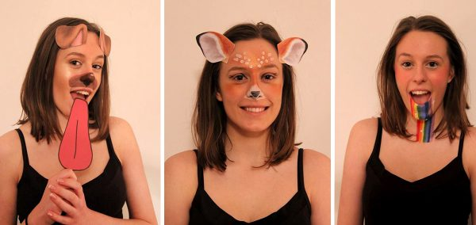

Réalité augmentée et détection faciale
==================================================


# Part 1. Introduction

* Définition du problème

  ** Réalité augmentée et détection faciale **

  ** Objectif: ** appliquer de filtres pour modifier un (plusieurs) visages 
  sur un flux de vidéo.
  



* Outils et langage de programmation :
  
  + Système d'exploitation
    - Linux
    - OsX (Mac)
    - Windows
  + Langage de progammation
    - Matlab
    - ***Pyhton***
    - C/C++
    - Autre
  + Outils
    - Système de contrôle de version (git, svn)
    - Github
  + Others

* Vision par Ordinateur et Traitement d'image

* D'autres ?

# Part 2. Qu'est-ce que c'est la vision par ordinateur ?
C'est un science dont le principal but est de permettre à une machine 
d'analyser, traiter et comprendre une ou plusieurs images prises par un système 
d'acquisition (la plus part du temps après une acquisition numérique).


# Part 3. Mettre en place de son environnement.

 * Installer [git](https://git-scm.com/download/) 
   
 * Installation du Python
   - Installer [Anaconda](https://www.anaconda.com/download/)

 * Créer un environnement Conda
 
   ```bash
      $> conda create -n facedetection  python=2.7 jupyter numpy  matplotlib opencv
   ```

 * Activer l'environnement et lancer le ***notebook jupyter***

   ```bash
      $> source activate  facedetection
      $> jupyter notebook
   ```


# Part 4. Démarrage  en python

Charger une image en python

```python
%pylab inline
```

```python
#import required libraries 
#import OpenCV library
import cv2
#import matplotlib library
import matplotlib.pyplot as plt
#importing time library for speed comparisons of both classifiers
import time 
```


```python
#load test iamge
test1 = cv2.imread('img/facedetecImg.jpg')
```

```python
#convert the test image to gray image as opencv face detector expects gray images 
gray_img = cv2.cvtColor(test1, cv2.COLOR_BGR2GRAY)
#if you have matplotlib installed then  
plt.imshow(gray_img, cmap='gray')
```

# Part 5. À faire

Lire tutoriels de Python et d'OpenCV [ici](http://docs.opencv.org/3.1.0/d0/de3/tutorial_py_intro.html)


